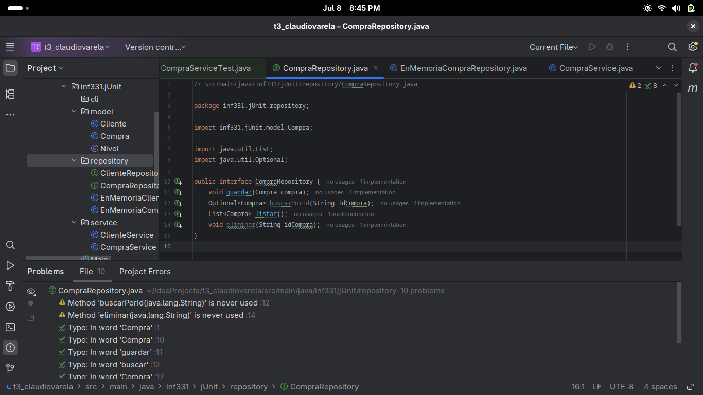

# Test Driven Development Proof

Este markdown deja evidencia del proceso TDD que fue utilizado para desarrollar la tarea 3 del ramo.
Para cada el desarrollo de: 

    - Gestion de clientes
    - Gestion de compras
    - Niveles de Fidelidad
    - Menu CLI

Primero se definirá la funcionalidad y luego el ciclo TDD de esta, para cada funcionalidad.

Primero comencemos con Gestion de clientes:

## Gestion de clientes

1. Agregar cliente

    Atributos requeridos:

        id (String)

        nombre (String)

        correo (String)

    Atributos iniciales por defecto:

        puntos = 0

        nivel = Bronce

    Validación: El correo debe contener @, sino se lanza una excepción.

Red

Green

Refactor
No es necesario.

---

2. Listar clientes

    Devuelve todos los clientes almacenados en memoria.

    Se espera que estén en una colección interna del repositorio o sistema.

Red

Green

Refactor
Futuro refactor podria mover la logica de almacenamiento a un repositorio de cliente

---

3. Actualizar cliente

    Permite modificar nombre y/o correo de un cliente existente por id.

    Validación: Nuevamente, el correo debe ser válido.

Red

Green

Refactor
Nada

---

4. Eliminar cliente

    Elimina un cliente por id.

    Si el cliente no existe, puede lanzar una excepción o retornar un valor que lo indique.

Red

Green

Refactor
Nada.

---

5. (Implícito) Obtener cliente por ID

    Aunque no se menciona directamente, es necesario para actualizar, eliminar o registrar compras.

Red

Green

Refactor
Nada.

---

Perfecto, ya acabamos con la gestion de los clientes, ahora continuemos con la gestion de compras, pero antes de esto, haremos un pequeño refactor para mover el almacenamiento a ClienteRepository

Ahora si, continuemos con la gestion de compras.

## Gestion de compras

Requisitos:

1. Registrar una compra con puntos base

| Atributo    | Detalles                            |
| ----------- | ----------------------------------- |
| `idCompra`  | Identificador único de la compra    |
| `idCliente` | ID del cliente asociado a la compra |
| `monto`     | Monto total de la compra            |
| `fecha`     | Fecha de la compra                  |

Regla base:
    Cada $100 genera 1 punto
    → Se usa redondeo hacia abajo

Red

Green

Refactor
Pronto cambiaremos la logica de almacenamiento a ComprasRepository.

---

2. Aplicar multiplicador por nivel

| Nivel   | Multiplicador |
| ------- | ------------- |
| Bronce  | ×1            |
| Plata   | ×1.2          |
| Oro     | ×1.5          |
| Platino | ×2            |

Se aplica después de calcular los puntos base.

Red

Green

Refactor
Implementaremos el repositorio de las compras
 

---

3. Bono por compras múltiples en el mismo día

    Si un cliente realiza 3 compras el mismo día, recibe un bono adicional de +10 puntos.
    Esta bonificación se reinicia cada día.

Red

Green

Refactor

---

4. Actualización del nivel de fidelidad

| Nuevo nivel | Puntos acumulados |
| ----------- | ----------------- |
| Bronce      | 0 – 499           |
| Plata       | 500 – 1499        |
| Oro         | 1500 – 2999       |
| Platino     | 3000+             |

Fue implementado con el multiplicador

---

5. CRUD de compras

    Agregar compra

    Listar compras

    Buscar compra por ID

    Eliminar compra (opcional, pero mencionado como "CRUD")

Implementaremos todos los casos para cada metodo en una sola iteración

Red

Green

Refactor
Nada.

Ahora podemos continuar con el menu CLI

## Menu CLI

## SonarQube coverage

## Diagramas

Diagrama de clases java

Diagrama de secuencia para una compra

